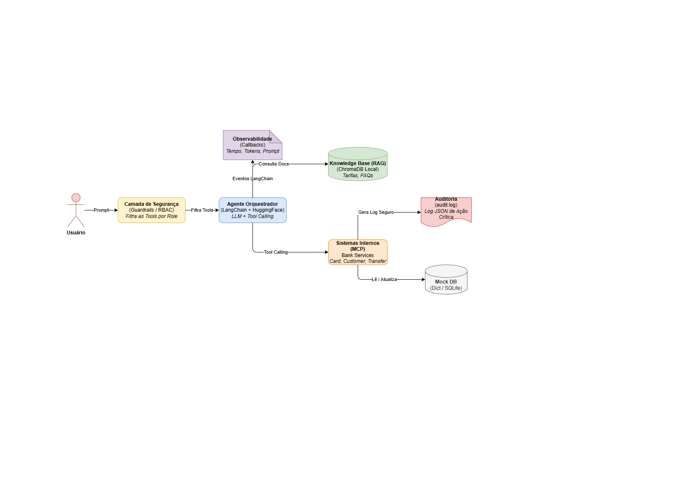

# bank_agent

Agente virtual bancário inteligente construído com LangChain, LangGraph e modelos do Hugging Face.

## Arquitetura

> Para uma explicação detalhada das decisões e trade-offs, consulte o **[ARCHITECTURE_AND_TRADEOFFS.md](./_docs/ARCHITECTURE_AND_TRADEOFFS.md)**.

## Como começar

Para configurar e rodar o projeto localmente, consulte o **[SETUP.md](./_docs/SETUP.md)**.

## Próximos Passos

Para ver a análise dos próximos passos, consulte o **[NEXT_STEPS.md](./_docs/NEXT_STEPS.md)**.
